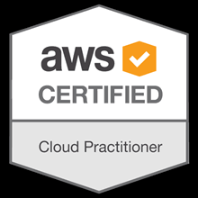

# AWS Cloud Practitioner Certification Exam - Study Guide

> [AWS Cloud Practitioner Certification Exam](https://aws.amazon.com/training/path-cloudpractitioner/)

The AWS curriculum can be found [here](https://www.aws.training/Details/Curriculum?id=27076).

- Sign in with AWS account to access the free course

## <u>Schedule</u>

| Section |             Topic             |        Time |
| :------ | :---------------------------: | ----------: |
| 1       |      Course Introduction      |   2 minutes |
| 1       | Introduction to the AWS Cloud |  20 minutes |
| 1       |             Text              |  45 minutes |
| 2       |    AWS Integrated Services    | 100 Minutes |
| 3       |       AWS Architecture        |  30 minutes |
| 4       |         AWS Security          |  50 minutes |
| 5       |      Pricing and Support      |  30 minutes |
| 6       |            Review             |  30 minutes |
| 7       |        Practice Tests         |         TBD |
| 8       |        Practice Tests         |         TBD |
